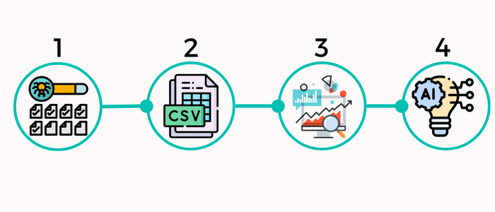
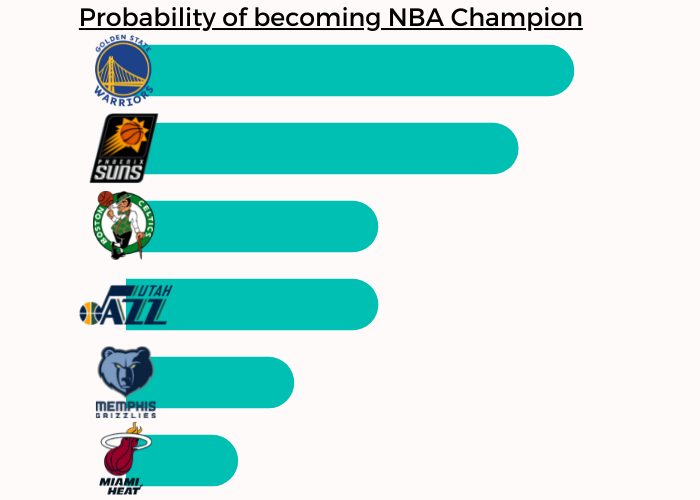
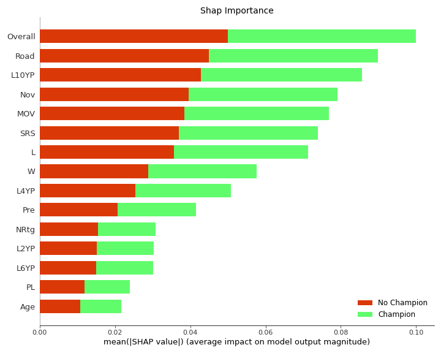
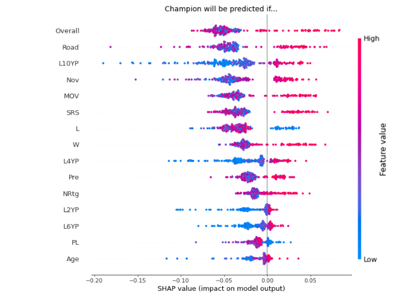
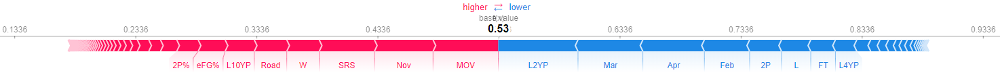
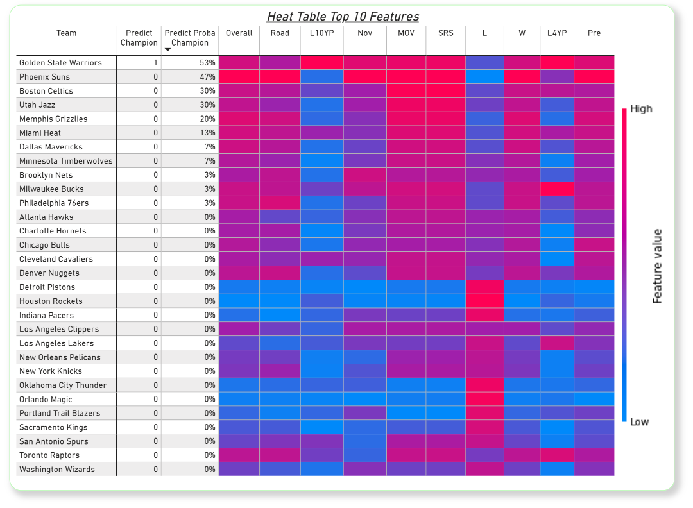

# NBA_2022_Champion
### ➭ Predict the 2022 NBA Champion with Machine Learning.
With the help of a lot of data around a basketball season, I try to predict the basketball champion for the year 2022. The following picture shows all the work steps that are carried out. I usually combine these steps in a fully automated pipeline, but since this is a side project and my free time is limited, the pipeline is split into 4 files that are executed sequentially.

##### ➤ 1 'nba_html_crawler.ipynb':
- Parse selected Basketball-Reference (Website) pages and save all team seasons in html-format. 
- [Basketball-Reference](https://www.basketball-reference.com/)

##### ➤ 2 'nba_html_to_csv.ipynb':
- Aggregate the data from the html pages and convert it to csv.

##### ➤ 3 'nba_csv_to_hdf5.ipynb':
- Analyze raw data and prepare data for ml analysis.

##### ➤ 4 'nba_ml.ipynb':
- Predict the 2022 NBA Champion with Machine Learning

##### ➤ Additional 'dashboard.pbix': 
- PowerBI file with a two simple plots, one of them is the HeatTable. 

----
## Results: 
### ➭ (For detailed information analyse the 'nba_ml.ipynb' file)  

 Much to my delight, I managed to use a classifier to correctly predict the outcome of the NBA Playoff.
Additionally, I examined the classifier's decision-making using [SHAP](https://github.com/slundberg/shap). From here I could get the questions
Which characteristics are important for the classifier to predict a champion. and How does the size of a feature affect prediction.
The two following plots show the detailed results. As my time is limited only a short hint for the interpretation of the plots.

#### Hint 1/2 for both pictures: The Feature with the highest impact on the classifier is on top.
#### Hint 2/2 for the second pictures: The RandomForest will predict 'Champion' if...
- the 'Overall' feature have a high value. -> (the team has won an above-average number of games in the regular season)
- the 'Road' feature have a high value. -> (the team has won an above-average number of games away from home)
- the 'L10YP' feature have a high value. -> (the team has excelled performed in the playoffs for the past 10 years -> playoff

  
#### So why were the Golden State Warriors predicted by the classifier as champions? 
- RED: For a championship speaks specifically(from left to right): good shooting, playoff experience, a lot of wins especially on the road, dominating the opponents
- BLUE: Against a championship speaks specifically(from left to right): bad performace in the past 2-4 years - last months in the season, only few shot attempts

  
#### Additionally the HeatTable Plot:

  
## Programming Language & Tools
- Python
- Pandas, Numpy, Scikit-Learn, SHAP
- PowerBI

## Feedback & Questions

If you have any feedback, please check out my email adress on my website or connect with LinkedIn. 

## 🔗 Links from the Author(Me)
[Portfolio/Website](https://thejk.de/) 
[LinkedIn](https://www.linkedin.com/in/jk05/)

